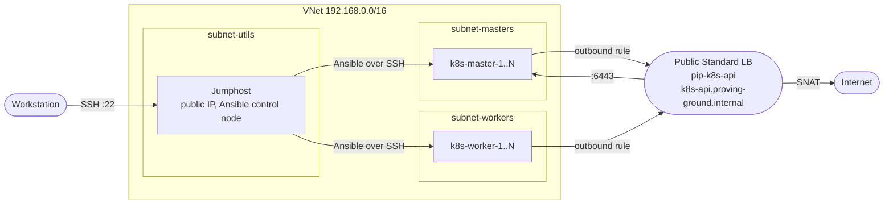

# KubeProvingGround

A Kubernetes testing ground. Use it to try new concepts on a real cluster and for continuous learning.

The goal is a lab that can emulate a production environment, in the cloud or on premises, where you
can break things on purpose and test new tools through CI/CD before they go anywhere that matters.

## Where it stands

This is a work in progress. What exists today:

- Terraform builds the machines and the network on Azure.
- Ansible prepares the nodes and installs the add-ons.
- The cluster itself is built with kubeadm, by hand, following the
  [installation guide](Documentation/cluster-installation-guide.md).

What is planned and does not exist yet: a second platform (on premises), chaos tests, and a CI/CD
pipeline for testing tools. See the [Roadmap](#roadmap).

Azure is the only provider for now. The cluster steps do not depend on it, so the Ansible roles and the
guide stay the same when another platform is added.

## How it should be used

The lab is for understanding the core parts of a cluster: the control plane, the kubelet, etcd and the
CNI. Those parts are built by hand here, so they are understood before they are automated.

Do each step by hand first. When the step is understood and can be broken and fixed, turn it into an
Ansible role. The lab grows that way, one role per concept.

The cluster is disposable. Build it, break it, fix it, destroy it at the end of the session and rebuild
it from nothing the next day.

The daily loop:

```
terraform apply  ->  Ansible prepares the nodes  ->  kubeadm by hand  ->  tests and drills  ->  terraform destroy
```

## What gets built

The diagram shows the Azure build.



| Component | Default |
| --- | --- |
| Region | `centralindia`. The zone is checked against the region at plan time |
| Nodes | 1 control plane, 2 workers, 1 jumphost. Ubuntu 24.04 LTS, `Standard_D2s_v3`, Spot |
| Disks | `StandardSSD_LRS`, 30 GB |
| Network | One VNet, one subnet per role, one NSG per NIC. Only the jumphost and the API load balancer have public IPs |
| API endpoint | Public Standard load balancer on 6443 and a private DNS record, created before the cluster exists |
| Egress | Masters and workers leave through one outbound rule on the same load balancer (TCP and UDP only). The jumphost uses its own public IP |
| Kubernetes | v1.34 with containerd and the systemd cgroup driver |
| Add-ons | local-path-provisioner, metrics-server, Gateway API with NGINX Gateway Fabric, NGINX Ingress Controller, cert-manager |

## Design decisions

- Terraform and Ansible do the repeatable work: VMs, kernel settings, containerd, packages and the
  add-ons. `kubeadm init`, the CNI and joining nodes stay manual, because they are the core of the
  cluster and are worth doing by hand every time.
- The control-plane endpoint is set before the first `kubeadm init`. `--control-plane-endpoint` cannot
  be changed without rebuilding the cluster. It points at a load balancer and a DNS name from day one,
  so masters 2 and 3 can join later without a rebuild.
- Everything is disposable. The lab is destroyed after every session. The VMs are Spot with the `Delete`
  eviction policy, even on the control plane. An eviction is an unplanned rebuild exercise.
- Terraform writes the Ansible inventory. It renders the inventory from its own outputs and copies it,
  with `Infrastructure/ansible/`, to the jumphost on every apply. Nobody copies IP addresses.
- The jumphost is the only way in. Masters and workers have private IPs only. SSH is open to the
  internet on the jumphost alone, with key-only authentication, for the few hours the lab exists each
  day.
- Some settings are lab shortcuts and would be wrong in production: SSH open to any address, host keys
  accepted on first contact, one control plane, and `--kubelet-insecure-tls` on metrics-server. They are
  deliberate, because the lab lives for a few hours and holds no data.
- Cost is a constraint. Small VM sizes, Spot pricing and destroying the lab when idle keep a 3-hour
  session cheap. Nothing bills after `terraform destroy`.

## Network scope on Azure

The network decisions on Azure, and the reason for each.

- One NSG per NIC. A single master or worker can be cut off on its own, which is what most break and fix
  tests need.
- One custom NSG rule, 6443 on the masters. Azure's default `AllowVnetInBound` rule carries the
  node-to-node cluster traffic, so no other port is opened.
- A public Standard load balancer for the API. It gives the masters and workers outbound internet access
  through an outbound rule, and a master can reach the API endpoint through it with several masters in
  the pool. An internal load balancer can do neither.
- One outbound rule for egress. Masters and workers share the `k8s-egress` pool, so the whole cluster
  leaves from one fixed IP. The masters are also in a second pool, `k8s-api-masters`, which carries the
  6443 rule, so no API traffic goes to the workers.
- 6443 is allowed from two IPs only: the load balancer's public IP, which the nodes come from, and the
  jumphost's public IP. Azure's default deny blocks everything else. Those NSG rules are what protect
  the API.
- TCP and UDP only on the way out. Load balancer outbound rules do not translate ICMP, so `ping` to the
  internet fails on masters and workers. Test with `curl`, `nc -vz <host> 443` or `mtr -T`. ICMP inside
  the VNet works.
- No NAT Gateway. It costs about $37 a month more and bills while the VMs are deallocated. The public
  load balancer adds one Standard public IP, about $3.65 a month.
- Load balancer associations run after the NSG association. Azure stores both on the NIC, and two
  writes to the same NIC at once can undo each other. The `vm-pool` module exposes
  `nic_ip_configurations` only after the NSG association exists, which sets the order.

## Repository layout

```
KubeProvingGround/
├── Cluster/                            # What runs on the cluster: a small app, backups and similar (placeholder)
├── Documentation/
│   └── cluster-installation-guide.md   # Stage-by-stage build
└── Infrastructure/
    ├── terraform/azure/
    │   ├── main.tf                     # Resource groups, network, VM pools, API load balancer, DNS, Ansible sync
    │   ├── variables.tf                # Cluster shape, zones, image and NSG rules, with validation
    │   ├── outputs.tf                  # Node IPs, API endpoint, Ansible inventory
    │   ├── cloud-init/                 # Jumphost bootstrap: Ansible, Git, automation key
    │   └── modules/
    │       ├── network/                # VNet and role-keyed subnets
    │       └── vm-pool/                # N identical VMs: NIC, NSG, optional public IP
    └── ansible/
        ├── playbooks/
        │   ├── k8s_nodes-init.yml      # Node prerequisites, containerd, kubeadm/kubelet/kubectl
        │   └── k8s_platform-up.yml     # Add-ons, run after the cluster is up
        └── roles/                      # common, containerd, k8s, k8s_platform
```

## Quick start

### Prerequisites

- Terraform 1.12.2 or newer, `jq`, and the Azure CLI, logged in with `az login`
- An SSH key at `~/.ssh/id_ed25519.pub`, and `ssh` and `scp` on your `PATH` OR change the SSH key on your repo :)
- Your subscription ID in `TF_VAR_subscription_id`

### 1. Build the infrastructure

```bash
cd Infrastructure/terraform/azure
terraform init
terraform apply
```

The apply finishes by copying `Infrastructure/ansible/` and the generated inventory to the jumphost.

### 2. Prepare the nodes

```bash
ssh azureadm@$(terraform output -json jumphost_public_ip | jq -r '."1"')

# on the jumphost
cd ~/ansible
ansible-galaxy collection install -r requirements.yml
ansible-inventory --graph                       # expect k8s-master, k8s-worker, k8s-jumphost
ansible-playbook playbooks/k8s_nodes-init.yml
```

### 3. Build the cluster by hand

Run `kubeadm init` against the load balancer endpoint, install the CNI and join the workers. Follow
sections 6 to 9 of the [installation guide](Documentation/cluster-installation-guide.md).

### 4. Install the add-ons

When every node is `Ready`:

```bash
ansible-playbook playbooks/k8s_platform-up.yml
```

This installs local-path-provisioner as the default StorageClass, metrics-server, the Gateway API CRDs
with NGINX Gateway Fabric, the NGINX Ingress Controller and cert-manager. It also installs `etcdctl` and
`etcdutl` on the first master, at the version of the running etcd. The add-on versions are pinned in
`roles/k8s_platform/defaults/main.yml`. The playbook is safe to run again, and each part has a tag:
`storage`, `metrics`, `gateway`, `ingress`, `cert-manager` and `etcd-tools`.

### 5. Tear down

```bash
terraform destroy
```

Nothing survives this. Copy off anything a later session needs first, such as an etcd snapshot.

## Troubleshooting

Start with the layer that failed. Each one has a quick check.

- Terraform. Run `terraform plan` again. The variables are validated, so a bad master count or zone
  fails at plan time with a message. A Spot eviction deletes the VM, and the next `terraform apply`
  builds it again.
- Ansible inventory. Run `ansible-inventory --graph` on the jumphost. It should show `k8s-master`,
  `k8s-worker` and `k8s-jumphost`. If the groups are missing, the inventory file is the problem. A file
  written on Windows must be UTF-8 without a BOM, or Ansible cannot read it.
- Ansible connection. Run `ansible all -m ping`. The jumphost uses its automation key, and every node
  trusts it from first boot.
- Playbooks. Both playbooks are safe to run again. Run a single part of the add-ons with its tag.
- Network. Test outbound access from a node with TCP, such as `curl` or `nc -vz <host> 443`. `ping` to
  the internet does not work on masters and workers.


The [installation guide](Documentation/cluster-installation-guide.md) lists what goes wrong at each
stage.

## Roadmap

- [ ] Three control planes behind the existing load balancer
- [ ] Cluster upgrade from 1.34 to 1.35 as a recorded drill
- [ ] Workloads under `Cluster/`: a small app, etcd snapshot and restore, backup tools
- [ ] Break and fix tests as scripts: break it, confirm it is broken, check the fix
- [ ] Chaos tests: node loss, disk pressure, etcd data loss
- [ ] A second platform, on premises, using the same Ansible roles
- [ ] A CI/CD pipeline for testing new tools against the cluster
- [ ] `terraform test` for the validation and zone rules
